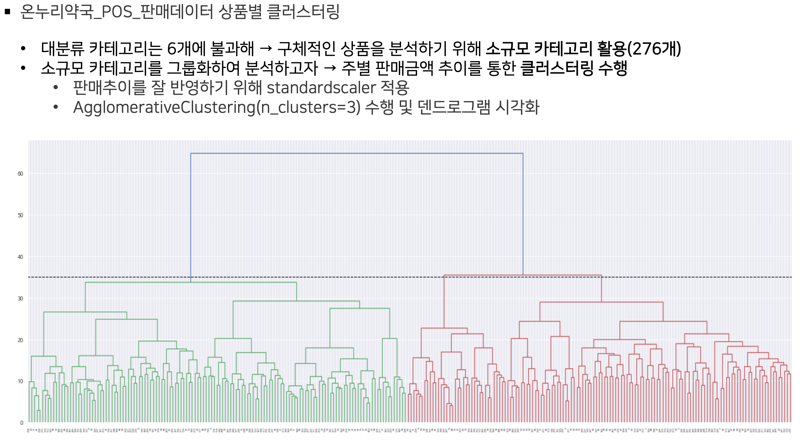
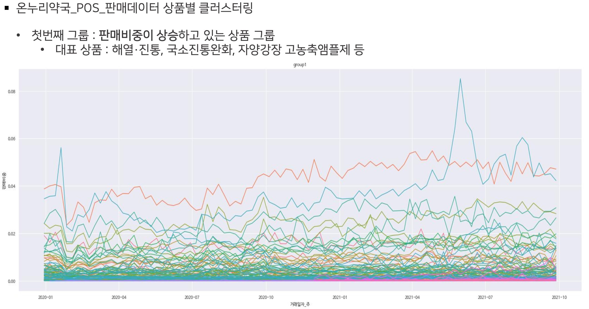
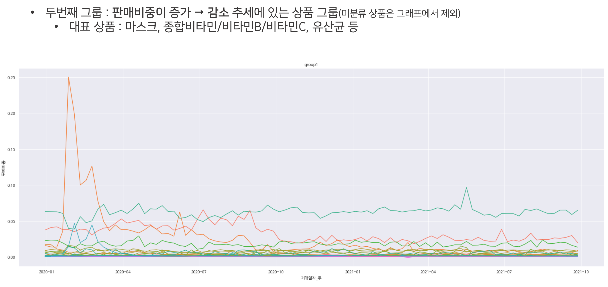
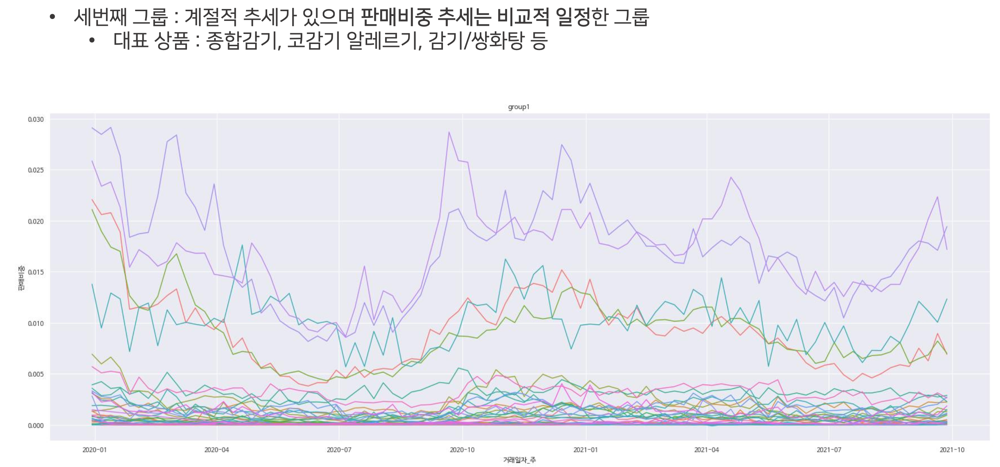

# 데이터 시각화 프로젝트
골목약국의 성장방안, 그 해답을 데이터로 찾다

[배경]
- 개인 약국의 경영난
- 디지털 전환 (원격의료)

[목적]
- 데이터 분석을 통해 코로나 이후 디지털 전환 시대의 골목약국의 성장방안 도출

[데이터]
- 온누리약국_POS_판매데이터(20.1월 ~ 21.9월)
- 코로나 확진 데이터
- 네이버 쇼핑 트렌드 데이터

[분석 방법]
- 일 → 주별 데이터 변환
- 카테고리별 클러스터링
- 데이터 시각화

[분석 내용]

[주요 툴]
- (데이터 프로세싱) 판다스, 넘파이
- (데이터 처리) 사이킷런
- (시각화) 맷플롯립, 시본

