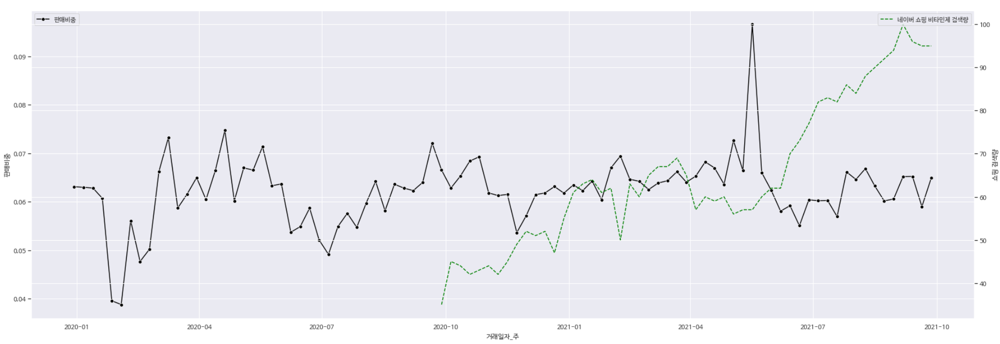

# 데이터 기반 골목약국 성장방안 제안 
- 부트캠프 데이터 시각화 프로젝트 ('21) : 최우수상

### 배경
- 골목약국의 경영난 ・ 원격의료 도입 등 환경 변화 
- 골목약국 **차별화 방안 마련**

### 데이터
- 온누리약국 POS 판매데이터(20.1월 ~ 21.9월)

- 코로나 확진 데이터
- 네이버 쇼핑 트렌드 데이터

### 데이터 전처리
- 일별 → 주별 데이터 변환

- 판매금액 → 판매비중 변환
    - (변환 이유) 판매금액은 변화가 크며, 상품 분류별로도 변화가 동일한 경향

    - **변화 추세가 비교적 일정한 판매비중으로 분석**

        
  
         
            
        <figcaption align="center"> (좌)판매금액 /   (우)판매비중</figcaption>

    

### 상품 군집화 및 그룹별 시각화
> A 그룹 : 판매비중이 상승

- 대표 상품 : 해열·진통, 국소진통완화, 자양강장 고농축앰플제 등

    

> B 그룹 : 판매비중이 증가 → 감소 추세

- 대표 상품 : 마스크, 종합비타민/비타민B/비타민C, 유산균 등

    

> C 그룹 : 계절적 추세 ・ 판매비중 추세는 비교적 일정

- 대표 상품 : 종합감기, 코감기 알레르기, 감기/쌍화탕 등

    

### 제안
> 아이디어
- 최근 판매비중이 낮아졌으나 **성장 가능성이 존재하는 상품(건강보조 / 종합비타민) 주목**  

    

    - 약사들의 **건강 관련 전문성, 상담능력 어필 필요** → 오남용 등 건강보조제 온라인 쇼핑의 문제점 해결 

    - (벤치마킹 사례) 경기도 포도약국 : 지역주민과 건강 상담 포커싱

> 근거
- 건강보조 / 종합비타민 판매비중은 코로나 확진자 증가로 높아지다, **'21년 중순 이후로 소폭 감소 추세**

    - 코로나 확진자 증가로 건강보조를 위한 비타민제 온라인 쇼핑은 꾸준히 늘어남
    - 반면, 약국은 그 영향을 받지 못한 것으로 보임
        - **건강 상담 및 건강보조제 구입처로 약국을 리포지셔닝할 필요**

        
        

### 주요 툴
- (데이터 처리) Python, Pandas, Numpy, Sklearn

- (데이터 시각화) Matplotlib, Seaborn

